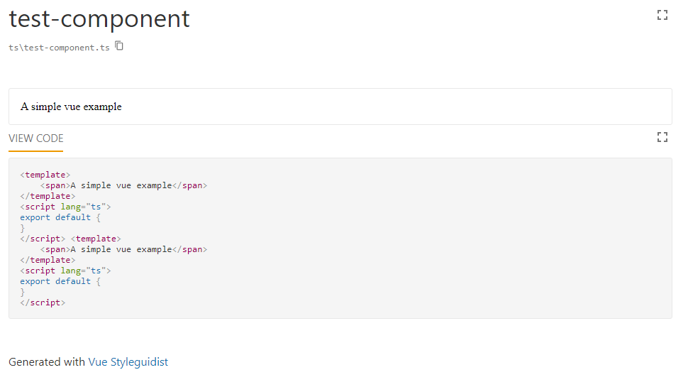
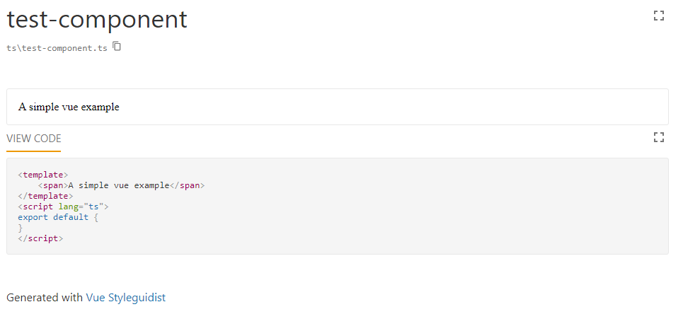

This repository should show an issue with VueStyleguidist > 4.50.0.

# Steps to reproduce
Intall the packages and run the documentation creation process.
```pwsh
npm i
npm run Documentation
```

**Open the file dist/index.html**

## Vue-styleguidist 4.54.3
The actual output will look like this:



## Vue-styleguidist 4.50.0
With an older version it seems to be correct.



